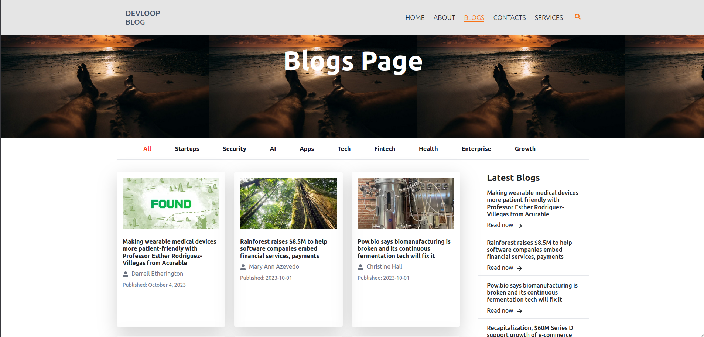

# React-Vite Blog Site - Frontend Practice Project

    

## Description :book:
This is a basic frontend implementation of a blog web application built as part of the requirements for the Tunga Impact Academy mentorship Programme.
The blog web application has supports a user manually search through blogs, click and read an article, search for a blog article.

## Built With :email:
- [JavaScript](https://javascript.info/) - Programming Language
- [Vite](https://vitejs.dev/) - Web Framework
- [BootStrap](https://react-bootstrap.netlify.app/) - Styling Library
- [Tailwind CSS](https://www.mongodb.com/atlas/database) - Styling Library
- [Vitest](https://vitest.dev/) - Testing Framework
- [React Testing Library](https://testing-library.com/) - Assertation Library
- [JsDom](https://github.com/testing-library/jest-dom?tab=readme-ov-file) - Assertation Library
- [npm](https://www.npmjs.com/) - Package and Dependency Management
- [Vercel](https://vercel.com/docs) - Deployment

## Authors :black_nib:
- Raymond Lukwago - [Github](https://github.com/lukwagoraymond) / [LinkedIn](https://www.linkedin.com/in/raymondlukwago/) 